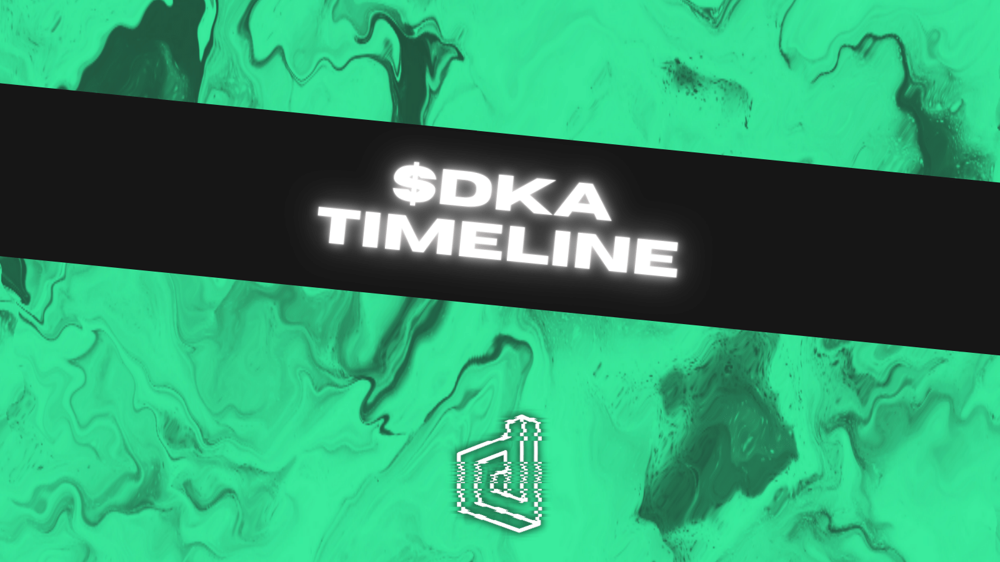

## Important Dates
- April 11th-16th (2pm UTC): $DKA Crowdpooling Campaign
- April 16th (4pm UTC): DEKA App opens for Liquidity Providers/Makers
- April 18th (4pm UTC): DEKA App opens for Everyone
- April 25th (6pm UTC): DEKA Mining Program Start

:::danger NOTE
Official DEKA Accounts & Sources:

- Website  [https://deka.finance](https://deka.finance)
- Blog [https://blog.deka.finance](https://blog.deka.finance/)
- Forum [https://discuss.deka.finance](https://discuss.deka.finance/)
- Discord  [https://discord.gg/HASWTEbVa8](https://discord.gg/HASWTEbVa8)
- Twitter [https://twitter.com/dekafinance](https://twitter.com/dekafinance)
- Telegram  [https://t.me/dekafinanceofficial](https://t.me/dekafinanceofficial)

Only trust information from these sources.
:::
<!--truncate-->
## Events

### 1.) Crowdpooling campaign on DODO
The initial token distribution will take place through a fair crowdpooling campaign on DODO. For this purpose, 800,000 tokens will be minted and offered for purchase by the community.

Crowdpooling has some advantages over traditional liquidity offerings like Bonding Curve, Auction or AMM on decentralized exchanges (DEXs).
- Prevents Frontrunning - all participants pay the same price.
- No need to inflate the token supply in circulation to bootstrap temporary liquidity.
- The immediate end result of Crowdpooling is a trading pair with sufficient liquidity.
- Raised amount from Crowdpooling participants can't be misused and is used to create a liquidity market.
- It builds a solid foundation for future influx of interest and capital, even if the bid size is small.

After the conclusion of the Crowdpooling campaign, $DKA tokens will be immediately sent to your wallet. DODO will then make the DKA/BUSD trading pair available for public trading.

#### Crowdpooling Metrics
- Total Number of tokens provided by project team: **800,000 $DKA**
- Crowdpooling Token Allocation: **400,000 $DKA**
- Crowdpooling Hard Cap: **100,000 $BUSD**
- Crowdpooling Token Price: **1 $DKA = 0.25 $BUSD**

The specific Crowdpooling link will be made public 24h before the start via Twitter and on this Blog Post.

You can find more information about Crowdpooling at <https://dodoex.github.io/docs/docs/crowdPooling> or join us on our social media channels.
### 2.) dApp Launch & 100,000 $DKA Mining Program
Over 100,000 $DKA tokens are up for grabs through the DEKA Mining Program. Here is how to participate.

For each day you are staked or adding liquidity, you will earn DEKA point. The points you earn are redeemable for $DKA at the end of the mining program, proportional to your ownership of the points. Here’s an example:

If there are 1,000,000 points earned by all participants and you earned 50,000 points, you account for 5% of the total points. You would receive 5,000 $DKA at the end of thirty days.

To earn DEKA points, you can do one of the three following things.
- **1.25x Multiplier**: Users who stake for a minimum of 30 days on the dApp.
- **2x Multiplier**: Users who add BNB/DKA, BUSD/DKA liquidity to the DEKA liquidity pool
- **4x Multiplier**: Users who add BNB/DKA, BUSD/DKA liquidity to https://app.deka.finance/pool

A daily snapshot will be taken of all holders. After 1 month, users will be able to redeem their earned $DKA. The program will start the day that the dApp launches.

More detailed information will be announced as soon as possible.