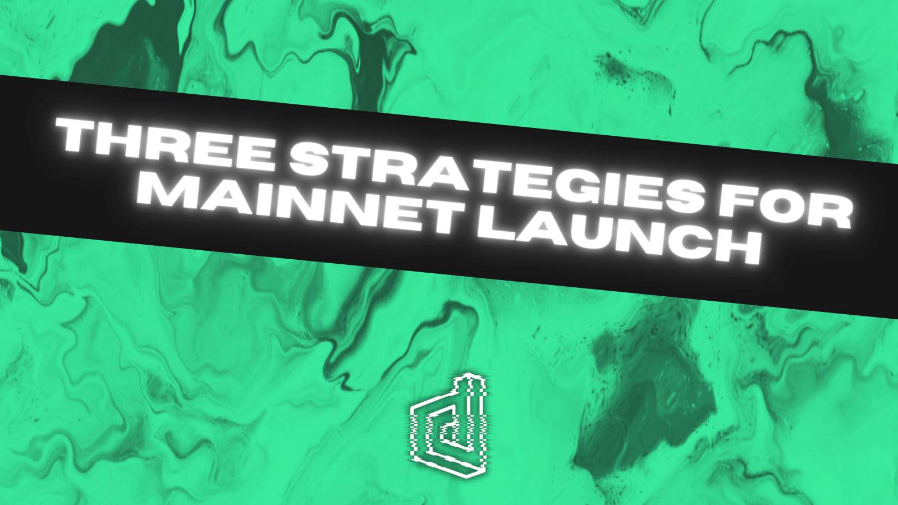
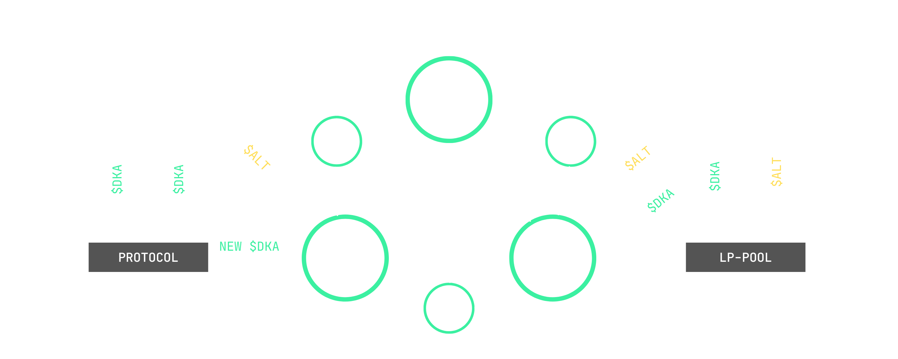

## Overview

We can't wait to launch the DEKA dApp and show you what we've been working on for the last few months. To help ensure that the initial onboarding experience goes as smoothly as possible, we wanted to share three strategies that you could use during the mainnet launch.

Be sure to check out the docs for a deep dive into DEKA, or watch out for the explainer video demonstrating a step-by-step dApp walkthrough which will be released soon.

Staker, Maker, or Taker?! Read on to know the differences and find your strategy. 

<!--truncate-->

## Stakers
> The people staking $DKA and earning instant yield (Altcoins)

Stakers will most likely cover around 80-90% of our initial user base for $DKA. See the image for an example of what you will encounter when staking on the dApp. The staker can be represented by the `Stake` tab.

Staking will be the most straightforward entry point into using the dApp. It's as simple as taking your $DKA and staking a set amount into the protocol for a predetermined amount of time.

At that point, new $DKA are generated because of your stake, and they go over to a liquidity pool of your choice (for example, $BUSD, $BNB, $BETH). Once you chose your desired pool, those alt-coins are sent to you immediately! It's as simple as that! After the stake duration is complete, you can unstake your original $DKA.  So, in the end, you'll receive your immediate upfront yield in the form of a BEP-20 token of your choosing and your initial $DKA.

## Makers
> The liquidity providers who earn stake/swap fees (just like Uniswap or PancakeSwap)

Makers cover the liquidity providers who earn stake/swap fees, much like on Uniswap or PancakeSwap.

DEKA is a permisionless protocol, so anyone can create any BEP-20 token pairing that they want, and create a pool for that pairing. Makers will primarily be engaging with either the `Pool` or `Create` tabs on the DEKA dApp. The `Pool` tab will allow users to deposit liquidity into a pre-existing pool (for example, $DKA/$BNB), while the `Create` tab is for users who want to create a new pool entirely for example $DKA/$CAKE.

Every time somebody initiates a stake or a take, makers are rewarded. Unlike Uniswap, DEKA maker rewards are dynamic earning anywhere from **0.1% - 10%** one each of those transactions. For sake of comparison, Uniswap, only offers a static fee of 0.3% per swap.

In terms of actual rewards for makers per every stake or take, all you do is take the Deka Percentage Yield (DPY) and divide it by five.

## Takers
> The arbitragers who balance the DEKA liquidity pools.

Takers represent the arbitragers who balance the $DKA liquidity pools. The taker can be represented by the `Swap` tab. What they’re doing is filling up the makers pool they're swapping in altcoins, and actually earning $DKA for doing so. They can choose to deposit or swap any token for $DKA. Just like on PancakeSwap, you'll perform a regular swap, and a percentage of that transaction will go directly to the liquidity providers.

Now why would anyone want to put in an altcoin and get $DKA in return? Well, if they happen to notice that $DKA is a different price on an exchange than what it is inside the DEKA dApp, they could then swap their $DKA and earn the altcoins. For example, if you have $100 of $BNB, you could potentially swap it for $120 of $DKA. Now, you’d have $20 extra dollars that you could, in theory, swap and keep doing whatever you want with!

Some other potential routes that takers can take, is they can take their newly received $DKA and:
- Stake it back on the dApp
- They could potentially pull it from the dApp altogether or…
- They can go straight to an exchange and swap it

## Summary

Hopefully this provided some clarity around the various details of the DEKA dApp, and it's got you feeling excited to play around with it on launch day. Will you be a Staker, a Taker, or a Maker?

Be sure to check out our socials to stay connected with everything about $DKA.
