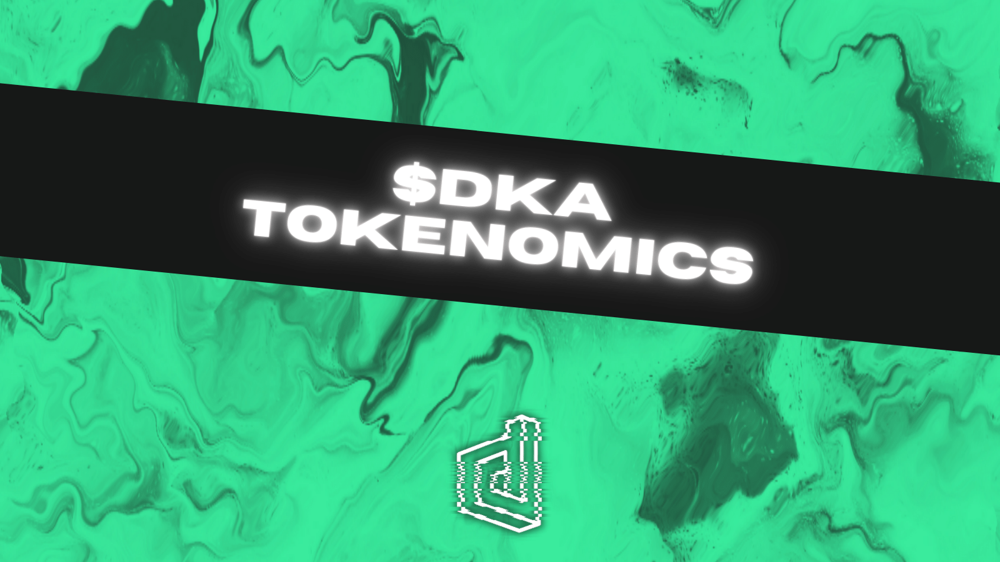

## Supply
- Max Supply: ~ 25,000,000 $DKA
- Circulating Supply: 1,500,000 $DKA

## Allocation & Distribution
The intial $DKA tokens supply were pre-minted, and are distributed as follows:
- Crowdpooling Campaign = 400,000 $DKA (1 $DKA = 0.25 $BUSD)
- Liquidity Pool = 400,000 $DKA
- Mining Program = 100,000 $DKA
- Bounties/Airdrops = 100,000 $DKA
- Team = 60,000 $DKA (1 $DKA = 0.25 $BUSD)
- Foundation = 440,000 $DKA

Our three team members have each purchased tokens for $5000 (3 x 20,000 $DKA x 0.25 $BUSD). The token price is the same as in the crowdpooling campaign. We decided to do this because we believe in the project and want to ensure a fair token launch, so everyone pays the same price. 

We want to be as transparent as possible. The funding from our team members will be used for further security audits and marketing campaigns. Furthermore, after the crowdpooling campaign has been successfully completed, we will burn the foundation tokens.

For more information about the token mechanism also read our [Documentation](https://docs.deka.finance/) and [FAQ](https://docs.deka.finance/protocol/faq). If you have any questions feel free to ask them in our forum or social media channels.